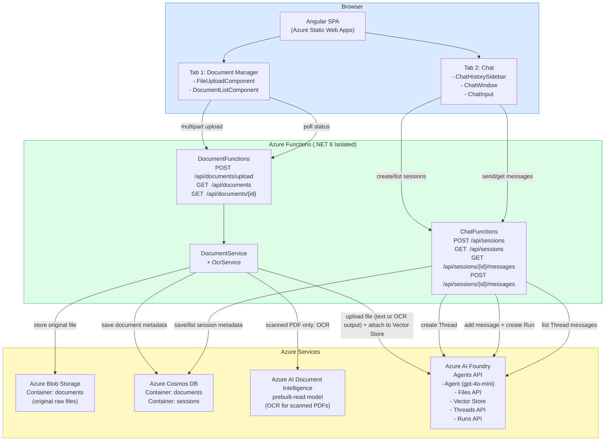
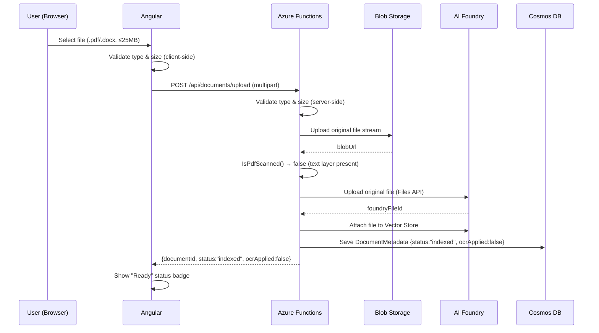
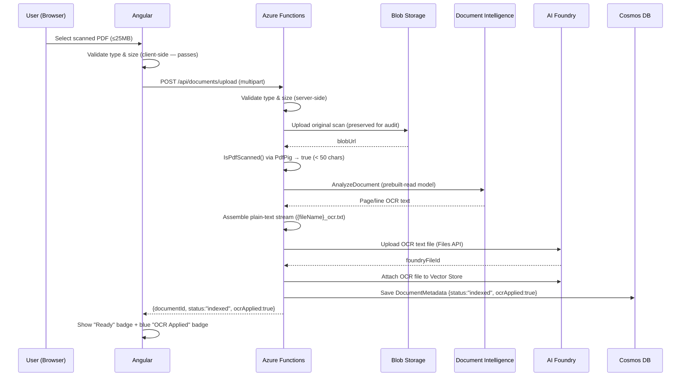
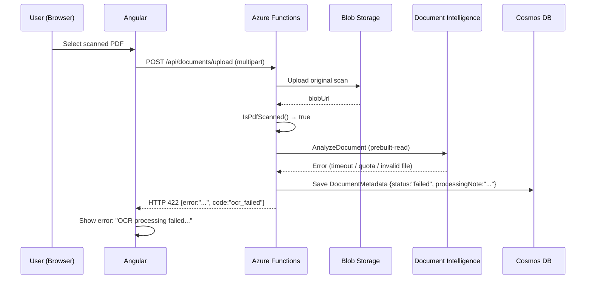
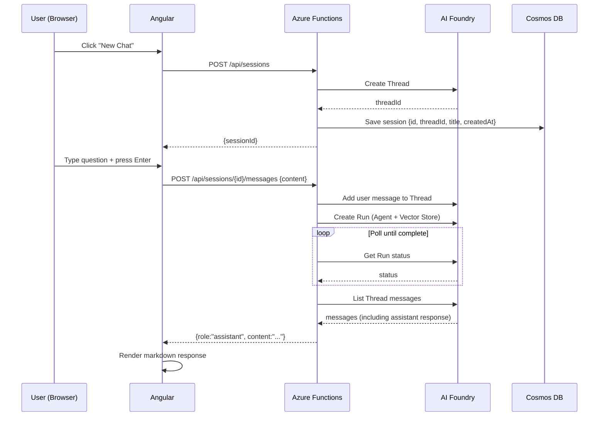

# Architecture Diagram

## Full System Diagram

## Document Upload Sequence — Text-Based PDF / DOCX

## Document Upload Sequence — Scanned PDF (Auto-OCR)

## Document Upload Sequence — OCR Failure

## Chat Session Sequence

